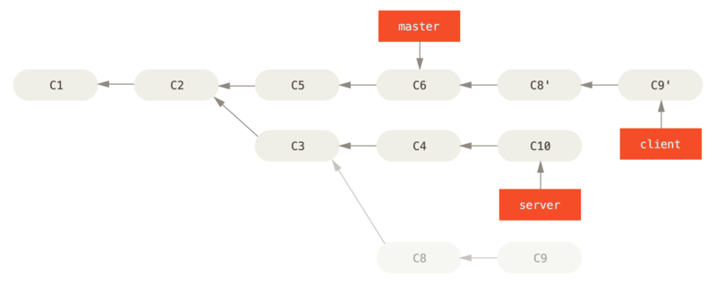

# Migrating a new version of Chromium

## Choose the tag of the desired Chromium version

Go to [https://chromiumdash.appspot.com/releases?platform=Android](https://chromiumdash.appspot.com/releases?platform=Android) and pick the desired tag.
For this example we update from **85.0.4183.127** to **87.0.4280.141**

We assume that a branch named *ecosia-85.0.4183.127* is present in the current repository. This is the source for our commits.

## Transfer new tag from Google (upstream) to our repo

For this we have cloned the source with following remotes (names can vary):

```bash
git remote -v
# google https://chromium.googlesource.com/chromium/src
# origin git@github.com:ecosia/chromium-android.git
```

Fetch tag from google and create new branch named upstream-\<tagname\>. In this case the new branch will be **upstream-87.0.4280.141** . We will also create a new branch that will become our target branch based on **ecosia-85.0.4183.127**

```bash
# fetch tag the current development branch is based on (if not present)
git fetch google refs/tags/85.0.4183.127:refs/tags/85.0.4183.127
# fetch new tag
git fetch google refs/tags/87.0.4280.141:refs/tags/87.0.4280.141
# create target branch
git checkout ecosia-85.0.4183.127 
git checkout -b ecosia-87.0.4280.141
```

## Apply ecosia commits

As Chromium major versions evolve on separate branches a simple rebase does not work. Therefore we do a rebase following this scheme:

```bash
git rebase --onto master server client
```

From [https://git-scm.com/book/en/v2/Git-Branching-Rebasing](https://git-scm.com/book/en/v2/Git-Branching-Rebasing):
>This basically says, “Take the client branch, figure out the patches since it diverged from the server branch, and replay these patches in the client branch as if it was based directly off the master branch instead.” It’s a bit complex, but the result is pretty cool.



Having checked out **ecosia-87.0.4280.141** this becomes:

```bash
git rebase --onto 87.0.4280.141 85.0.4183.127 ecosia-87.0.4280.141
```

Explained

- master = 87.0.4280.141 (basically the new master, where want to put our commits on top)
- server = 85.0.4183.127 (basically the old master, serves as starting point for diffing)
- client = ecosia-87.0.4280.141 (at start equal to ecosia-85.0.4183.127, so where to take the commits from)

This will start the rebase. After all conflicts are solved all commits that were done between 85.0.4183.127 and ecosia-85.0.4183.127 will be on top of 87.0.4280.141.

## Make it compile

As we switched major versions we have to get updated 3rd parties. I recommend to run [getThirdParties.sh](/getThirdParties.sh) completely or step by step depending whether it's a fresh checkout or a one that was already synced.
